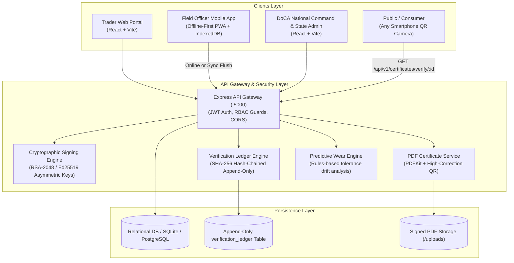
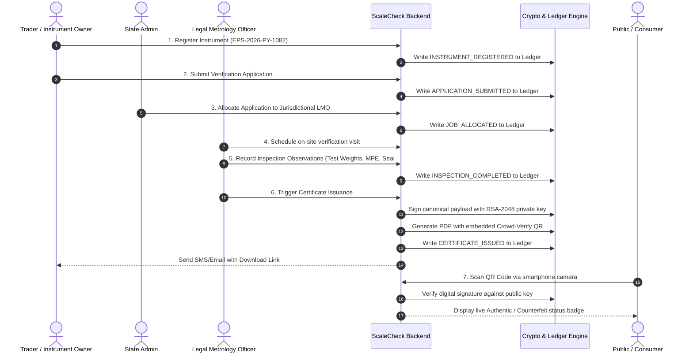

# ScaleCheck — System Architecture & Data Flow

**Organization:** Ministry of Consumer Affairs, Food & Public Distribution (Department of Consumer Affairs - DoCA)  
**Legal Mandate:** Legal Metrology Act, 2009 & Legal Metrology (General) Rules, 2011  

---

## 1. High-Level Architecture Diagram

---

## 2. End-to-End Verification Lifecycle

---

## 3. Offline-First Mobile Synchronization Flow

1. **Before field visits:** The Legal Metrology Officer taps **"Download Today's Assigned Queue"** while at the departmental office.
2. **In the field (Rural Mandi / Petrol Pump):** Even with zero cellular coverage (`OFFLINE` mode), the officer:
   - Tests accuracy using certified working standard weights.
   - Records observed errors and physical lead seal numbers.
   - Captures geo-tagged photo evidence.
   - Caches the record with a client-generated UUID into browser IndexedDB (Dexie.js).
3. **Back online:** The synchronization engine detects cellular signal (or manual **"Sync Now"**), flushes queued inspections via `POST /api/v1/inspections/sync-offline`, resolves any optimistic conflicts, and anchors the records into the national ledger.
