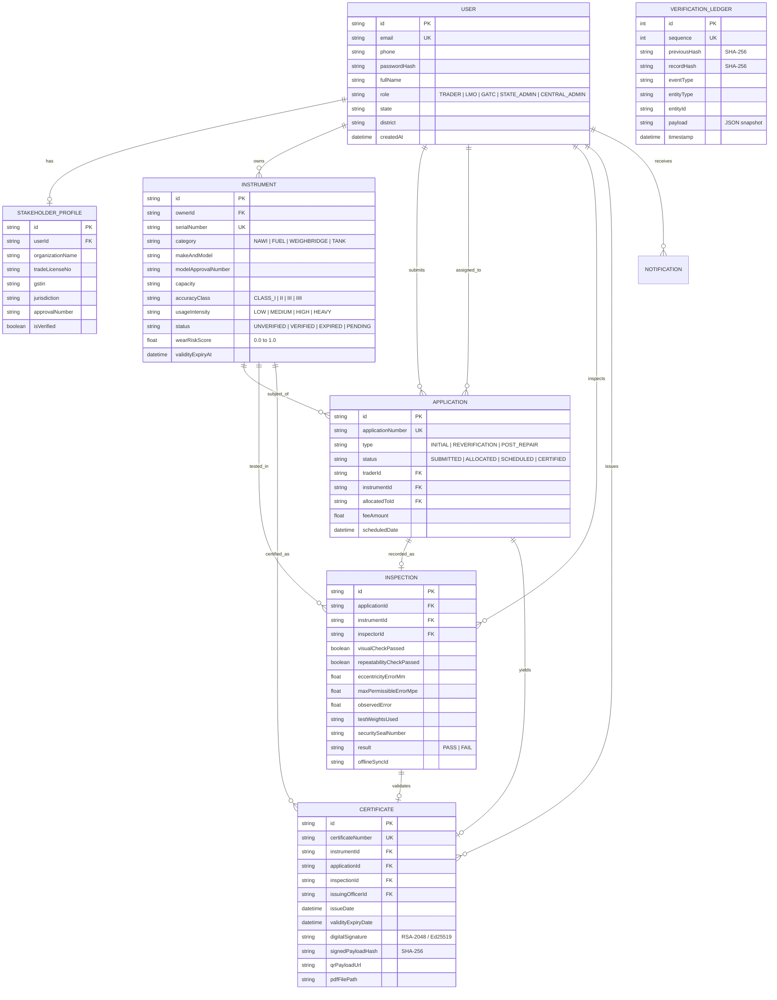

# ScaleCheck — Entity-Relationship (ER) Diagram & Schema

```mermaid
erDiagram
    USER ||--o| STAKEHOLDER_PROFILE : "has"
    USER ||--o{ INSTRUMENT : "owns"
    USER ||--o{ APPLICATION : "submits"
    USER ||--o{ APPLICATION : "assigned_to"
    USER ||--o{ INSPECTION : "inspects"
    USER ||--o{ CERTIFICATE : "issues"
    USER ||--o{ NOTIFICATION : "receives"

    INSTRUMENT ||--o{ APPLICATION : "subject_of"
    INSTRUMENT ||--o{ INSPECTION : "tested_in"
    INSTRUMENT ||--o{ CERTIFICATE : "certified_as"

    APPLICATION ||--o| INSPECTION : "recorded_as"
    APPLICATION ||--o| CERTIFICATE : "yields"

    INSPECTION ||--o| CERTIFICATE : "validates"

    USER {
        string id PK
        string email UK
        string phone
        string passwordHash
        string fullName
        string role "TRADER | LMO | GATC | STATE_ADMIN | CENTRAL_ADMIN"
        string state
        string district
        datetime createdAt
    }

    STAKEHOLDER_PROFILE {
        string id PK
        string userId FK
        string organizationName
        string tradeLicenseNo
        string gstin
        string jurisdiction
        string approvalNumber
        boolean isVerified
    }

    INSTRUMENT {
        string id PK
        string ownerId FK
        string serialNumber UK
        string category "NAWI | FUEL | WEIGHBRIDGE | TANK"
        string makeAndModel
        string modelApprovalNumber
        string capacity
        string accuracyClass "CLASS_I | II | III | IIII"
        string usageIntensity "LOW | MEDIUM | HIGH | HEAVY"
        string status "UNVERIFIED | VERIFIED | EXPIRED | PENDING"
        float wearRiskScore "0.0 to 1.0"
        datetime validityExpiryAt
    }

    APPLICATION {
        string id PK
        string applicationNumber UK
        string type "INITIAL | REVERIFICATION | POST_REPAIR"
        string status "SUBMITTED | ALLOCATED | SCHEDULED | CERTIFIED"
        string traderId FK
        string instrumentId FK
        string allocatedToId FK
        float feeAmount
        datetime scheduledDate
    }

    INSPECTION {
        string id PK
        string applicationId FK
        string instrumentId FK
        string inspectorId FK
        boolean visualCheckPassed
        boolean repeatabilityCheckPassed
        float eccentricityErrorMm
        float maxPermissibleErrorMpe
        float observedError
        string testWeightsUsed
        string securitySealNumber
        string result "PASS | FAIL"
        string offlineSyncId
    }

    CERTIFICATE {
        string id PK
        string certificateNumber UK
        string instrumentId FK
        string applicationId FK
        string inspectionId FK
        string issuingOfficerId FK
        datetime issueDate
        datetime validityExpiryDate
        string digitalSignature "RSA-2048 / Ed25519"
        string signedPayloadHash "SHA-256"
        string qrPayloadUrl
        string pdfFilePath
    }

    VERIFICATION_LEDGER {
        int id PK
        int sequence UK
        string previousHash "SHA-256"
        string recordHash "SHA-256"
        string eventType
        string entityType
        string entityId
        string payload "JSON snapshot"
        datetime timestamp
    }
```
